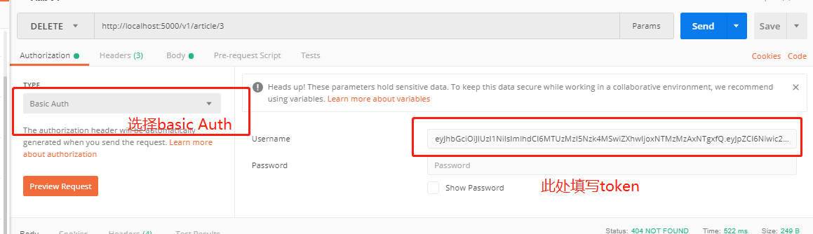

- 添加普通用户
```
method: POST
url: /v1/user
{
	"nickname": "yhdedll",
	"password": "hello"
}
```

- 添加超级用户
```
python fake.py
```


- 获取token(登录）
```
method: POST
url: /v1/auth
{
	"nickname": "yhdedll",
	"password": "hello"
}
```

- 携带token的方式为




- 添加文章

```
method: POST
url: /v1/article

{
	"title": "yhdedll",
	"content": "hello"
}
```

- 获取所有文章
```
method: GET
url: /v1/article

```


- 删除文章

```
method: DELETE
url: /v1/article/1
```

- 修改文章

```

method: PUT
url: /v1/article/1

{
	"title": "yhdedll",
	"content": "hello"
}

```

#### 返回信息

- 格式:

 ```
{
     "error_code": 自定义错误码,
    "msg": 错误详细或成功详细,
    "request": 这里显示的是请求的方法和路径
 }
 ```

- error_code:

```
-1 删除成功
0 获取成功
1 添加成功
999  未知错误
1006  客户端错误
1007  服务器错误
1000 参数错误
1001 notfound
1002 token过期或者无效
1004 Forbidden
1005 授权失败
```